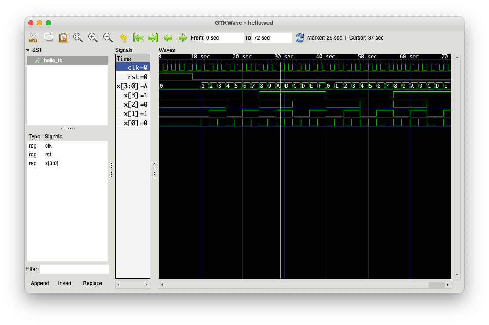

Verilog Hax
===========

Learning some basic Verilog development.

My goal is to figure out just enough to define a 6502 system controller FPGA which can:

- copy bootstrap code at start-up
    - read from SPI flash EEPROM
    - write to to main SRAM
- manage the system clock
    - run / pause / divide / etc based on an external oscillator
- map different address ranges to different RAM/IO/etc; glue logic
    - possibly stateful/modal, e.g. bank switching etc
- expose a hardware SPI controller to the 6502 CPU, ala http://6502.org/users/andre/spi65b/index.html

Notes
-----

### GTKWave on macOS

https://ughe.github.io/2018/11/06/gtkwave-osx

```
brew install gtkwave
sudo /usr/bin/cpan install Switch
```

GTKWave showing the 4-bit counter simulated in commit `d1c6c06`:



References
----------

### Verilog

- https://en.wikipedia.org/wiki/Verilog
- https://cs233.github.io/verilogreference.html

### Test benches

- https://alchitry.com/blogs/tutorials/writing-test-benches
- https://technobyte.org/testbench-in-verilog/
- https://verilogguide.readthedocs.io/en/latest/verilog/testbench.html
- https://www.fpgatutorial.com/how-to-write-a-basic-verilog-testbench/

### Waveform tools

- http://referencedesigner.com/tutorials/verilog/verilog_13.php
- https://iverilog.fandom.com/wiki/GTKWave
- https://ughe.github.io/2018/11/06/gtkwave-osx

### Microchip Verilog models

- https://www.microchip.com/doclisting/TechDoc.aspx?type=Verilog
